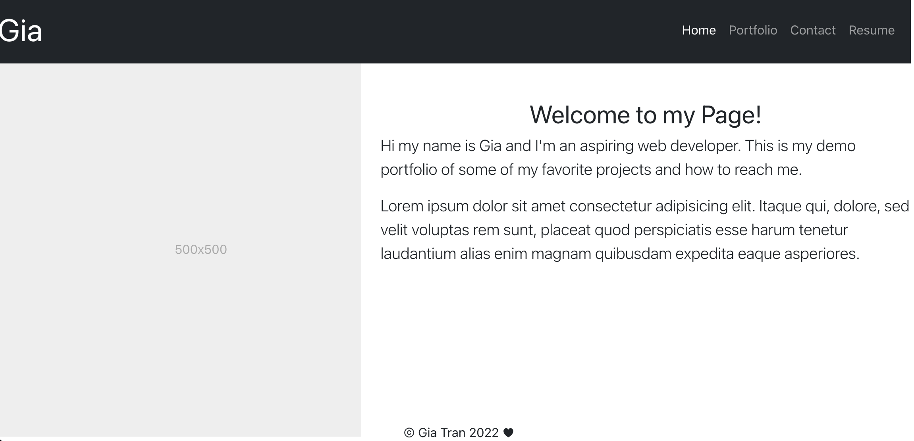
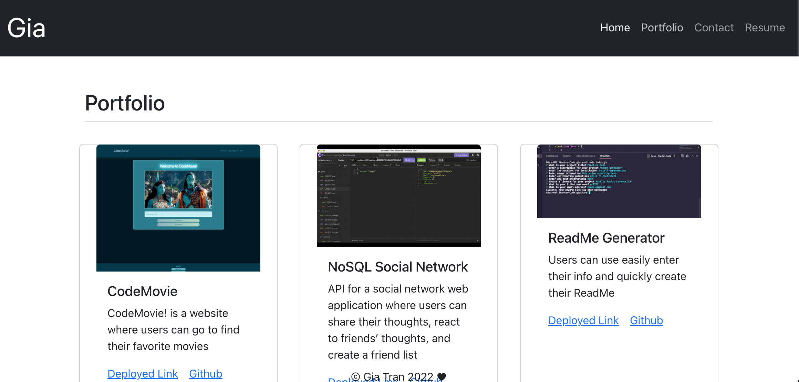
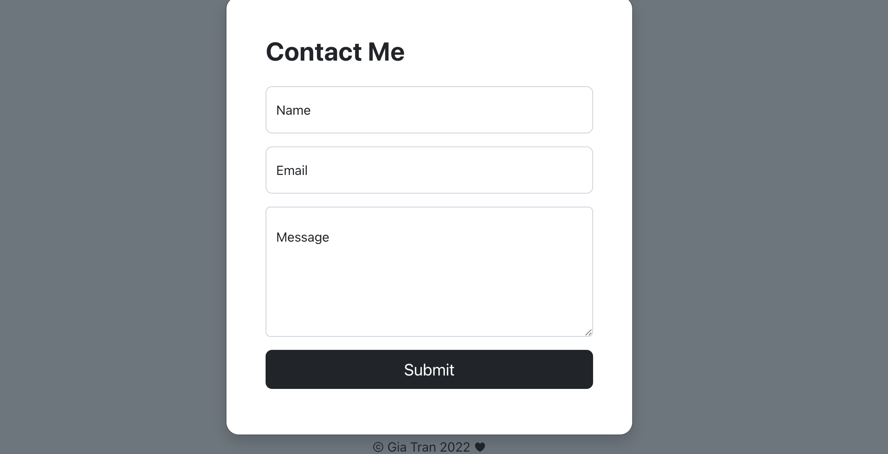
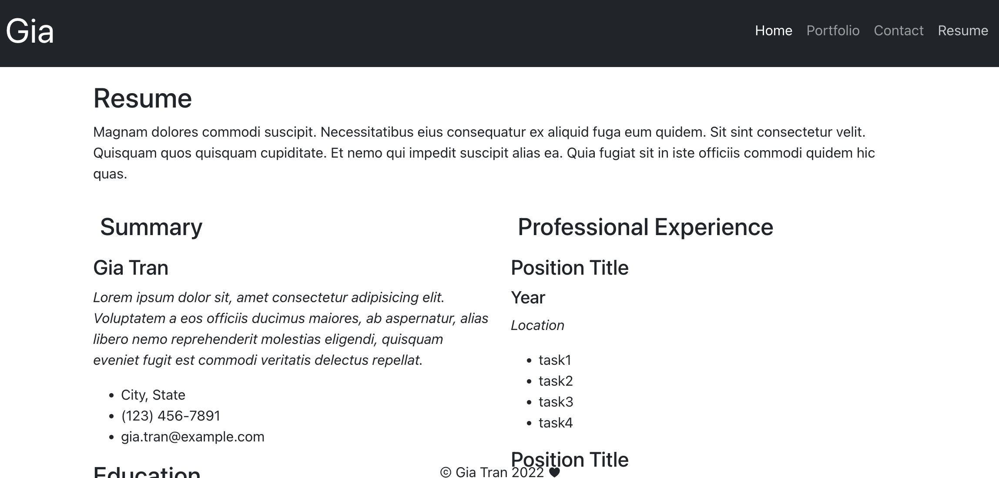

# React-Portfolio

## Description
This is a demo react portfolio for me and how I kind of want it to look like. It turned out nicer than I thought and I would love to continue working on the UI, fill out the information and have make the site more functional.

The hardest part was the set up and making sure all the pages and components link up and to map through the images for each project. Turns out I had to link the images differently for react to find the file path.


## Installation
1. Download or clone repository
2. React version 17
3. `npm install`

## Usage
The application will be invoked by using the following command:

```bash
npm start
```





## Links
[Deployed Link](https://gt1222.github.io/React-Portfolio/)

[Github](https://github.com/gt1222/React-Portfolio)